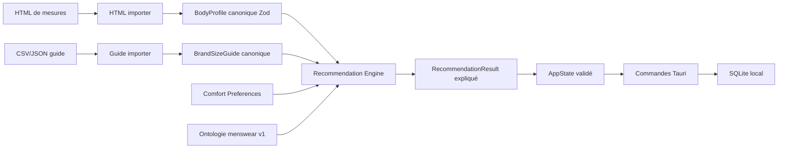

# Architecture

## Découpage

- `src/domain`: logique métier indépendante de React.
- `src/domain/ontology`: ontologie menswear v1 validée par Zod et reliée à la taxonomie moteur.
- `src/domain/sizing`: règles pures d’aisance, scoring, pondération et confiance.
- `src/services`: import, export, recommandation et persistance.
- `src/db`: schéma Drizzle, repository et mappers.
- `src/features`: pages applicatives.
- `src/components`: shell, composants métier et composants shadcn/ui internalisés.
- `src-tauri`: app desktop, pont SQLite et exécution des migrations SQL versionnées.

## Flux de données

## Principes

- Le moteur de recommandation ne dépend pas de React.
- Les imports ne polluent pas le domaine: ils produisent des objets validés.
- Les données sensibles restent locales.
- Les guides sample sont explicitement marqués et diminuent la confiance.
- Les conversions de tailles génériques ne sont pas traitées comme exactes.
- Les vues `ontology-viewer`, `rules-explorer` et `diagnostic-viewer` sont reliées au shell et aux exports.

## Persistance

En web-dev, l’état est stocké dans `localStorage` pour permettre les tests Playwright sans Tauri. En desktop, Tauri écrit dans SQLite sous le dossier de données local utilisateur. Les deux chemins utilisent le même `AppState` Zod.
